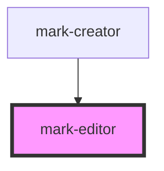

# my-component

<!-- Auto Generated Below -->

## Events

| Event       | Description | Type                      |
| ----------- | ----------- | ------------------------- |
| `markInput` |             | `CustomEvent<InputEvent>` |

## Dependencies

### Used by

 - [mark-creator](../mark-creator)

### Graph

----------------------------------------------

*Built with [StencilJS](https://stenciljs.com/)*
