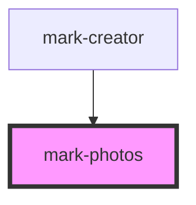

# mark-photos

<!-- Auto Generated Below -->

## Methods

### `getImages() => Promise<Map<string, File>>`

#### Returns

Type: `Promise<Map<string, File>>`

### `load(file: File) => Promise<void>`

#### Parameters

| Name   | Type   | Description |
| ------ | ------ | ----------- |
| `file` | `File` |             |

#### Returns

Type: `Promise<void>`

## Dependencies

### Used by

 - [mark-creator](../mark-creator)

### Graph

----------------------------------------------

*Built with [StencilJS](https://stenciljs.com/)*
